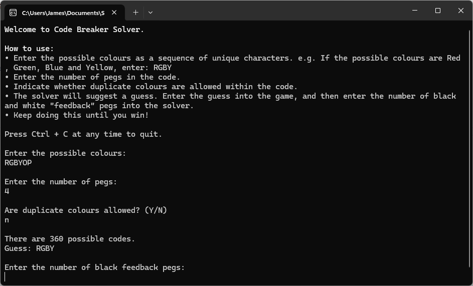

# Code Breaker Solver

As I was finishing off my [Code Breaker Game](https://github.com/jameschiffey/code-breaker-game), I started to wonder how a computer would solve the code.

It turns out there's a well known brute-force approach, which works as follows.

1. Generate every possible code (given the colour and peg count constraints in place).
1. Select a code from the list (could be at random, or just the first in the list).
1. Take the feedback from the game (black/white peg count), and for each possible code determine if the guess + code combination would result in the feedback.
1. If the guess + code combination would not result in the feedback, remove the code from the list of possible codes.
1. Go back to step 2 until the code is solved.

My implementation is written in C# (.NET 8) with NUnit unit tests.

## Further optimisations

The optimal first guess in Mastermind, for a 4 peg game, is supposed to be two double colours. e.g. RRGG.[^1]

My implementation doesn't work that way, as it simply picks the first code in the list of possible codes.

[^1]: https://en.wikipedia.org/wiki/Mastermind_(board_game)#Worst_case:_Five-guess_algorithm

